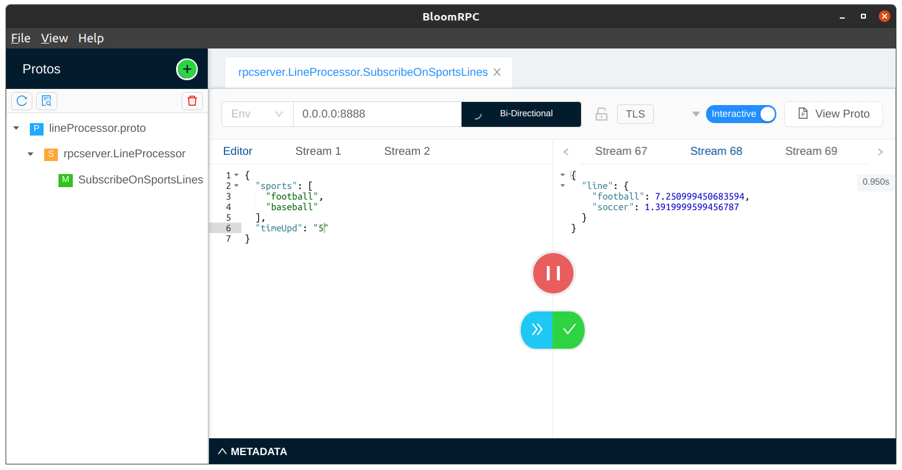

# task
Тестовое задание на позицию Junior Go Developer

### Использование
```sh
make build #запуск сборки
make generate #компиляция .proto файла 
make lint #запуск линтера
make tests #запуск тестов
make run #запуск контейнеров в docker-compose
make stop #остановка контейнеров в docker-compose
```

### Зависимости
* logrus
* redis
* gorilla/mux
* protobuf
* envconfig
* testify
* grpc

### Список параметров
Параметры задаются в файле docker-compose.yml
* UPD_INTERVAL_FOOTBALL (указывается в секундах)
* UPD_INTERVAL_SOCCER (указывается в секундах)
* UPD_INTERVAL_BASEBALL (указывается в секундах)
* LOG_LEVEL (logrus levels: Trace, Debug, Info, Warn, Error, Fatal, Panic)

### Тестирование
Тестирование производилось с помощью утилиты [BloomRPC](https://github.com/uw-labs/bloomrpc).

